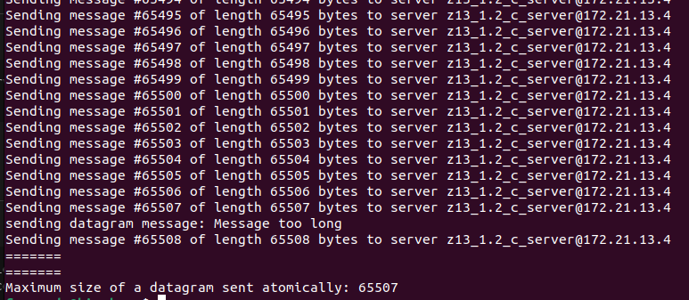
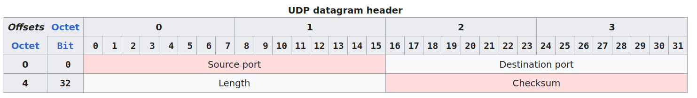

  
To explain the maximum size of a UDP datagram sent atomically, lets refer to the UDP header structure:
  
  
```Length``` field specifies the total length of a datagram (which includes header length + data length). At first sight, it implicates that the maximum size of a datagram should be 2^16 - 1 (length field is 16 bits long) - 8 (UDP header size) = 65527 bytes  
However, the underlying protocol is IPv4 and its header length is 20 bytes.  
The final result thus becomes 65527 - 20 = 65507 bytes which is exactly the same number we obtained by completing the exercise.